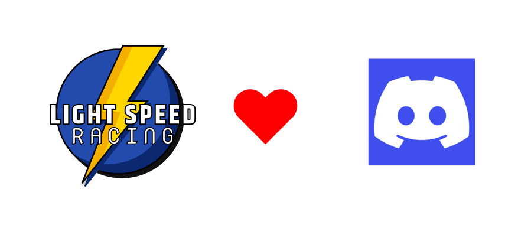

# discord-bot
This is the discord bot that is running the Light Speed Racing discord server.

The idea beghind this bot is to make every day live easier.

This bot is build using [nestjs](https://nestjs.com/), [fjodor-rybakov/discord-nestjs](https://github.com/fjodor-rybakov/discord-nestjs), [typeorm](https://typeorm.io/) with [@netsjs/typeorm](https://docs.nestjs.com/techniques/database)

### Local development
Start by copying the `template.env.json` to `.evn.json` and set update your own `discord token` and `guild id`. The database credentials that already is in the files matches the one configured for docker.

In your terminal type
```sh
  mv template.env.json .env.json
```
**Note:** Make sure to update the discord token and discord guild id to your development discord server.
